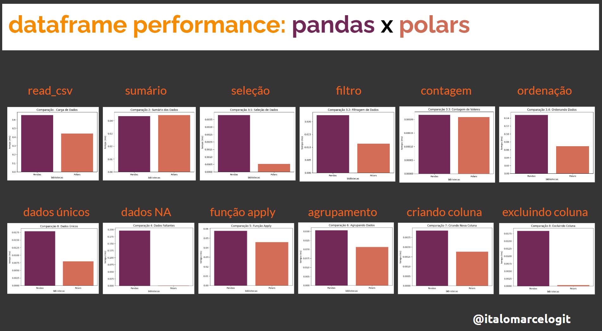

# Dataframe Performance: Pandas versus Polars

Olá amigos, o intuito deste notebook é somente comparar a performance entre uma biblioteca super popular como o Pandas e a biblioteca alternativa Polars, projetada para processar dados com maior rapidez.
O Pandas é uma biblioteca python essencial para análise de dados e toda a sua ciência, mas ele possui uma grande desvantagem por ser lento ao trabalhar com grande volume de dados. Com isso, desenvolveram essa biblioteca Polars que tem como filosofia acelerar o processo e manipulação de grandes volumes de dados.

Deixo aqui todos os créditos a comunidade Polars que contribui para que nós possamos testar, comparar e aproveitar os recursos que essas duas maravilhas oferecem ao nosso dia a dia.

<a href="https://pola-rs.github.io/polars-book/">Polars Guide</a>

<a href="https://pandas.pydata.org/pandas-docs/stable/index.html">Pandas</a>

Para executar comparativo é necessário Google Colab ou qualquer outro ambiente de jupyter notebook 

Excelente aprendizado!!!
